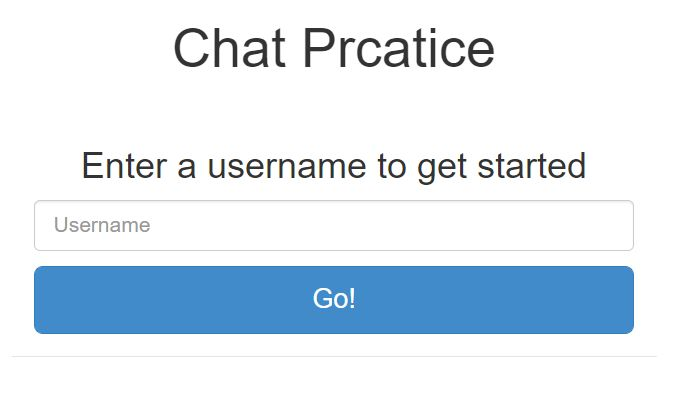
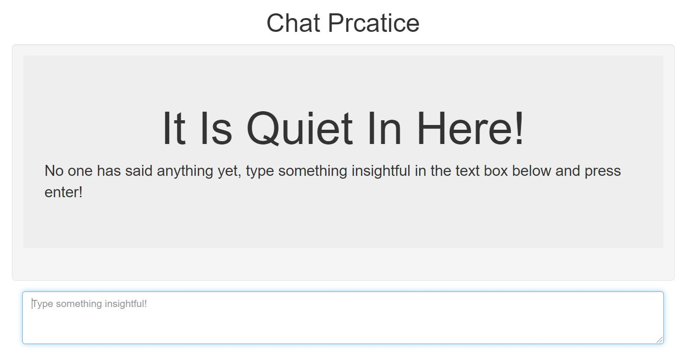
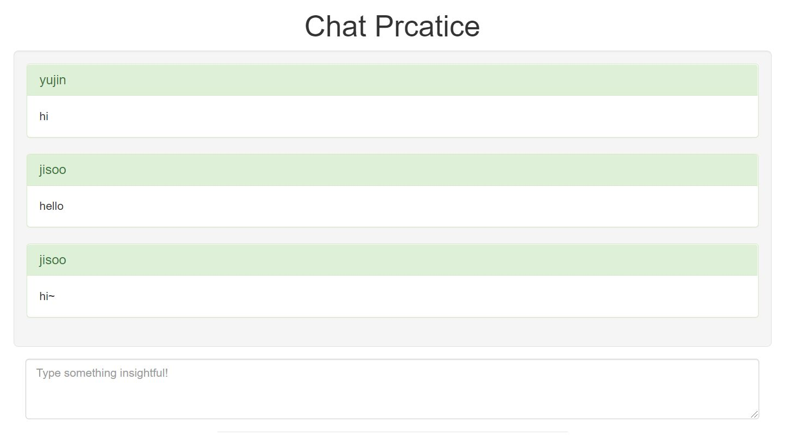

# basic : pub/sub

## Project

* 생성
    ```shell
    npm init
    ```
* 설치
  ```shell
  npm i redis
  npm i express
  ```

## practices

* [publisher_ex](publisher_ex/index.js)
  * use
    * redis
    * express
* [pubsub_in-one-file](pubsub_in-one-file/index.js)
  * use
    * redis
  * 2개의 메세지 보내고 바로 종료
* [chat_ex](chat_ex)
  * use
    * redis
      * redis server에 데이터 넣기 X
      * pub/sub
    * express
  * chatting example
    * 방 한개
    * index.js에서 publisher를 하나로 해놓음('chatter')
    * client : list
  * result

    |닉네임 입력|챗 첫화면|채팅|
    |:---:|:---:|:---:|
    ||| |
* [store_chat_ex](store_chat_ex)
  * use
    * redis
      * pub/sub X
      * 데이터 저장
    * express
    * socket.io
  * 특징
    * 방 한개
    * pub/sub 대신 socket.io 사용
    * 데이터를 redis에 저장해서 예전 대화를 불러올 수 있음

## Usage

* 실행
  ```bash
  npm start
  node index.mjs
  ```