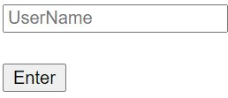

# store chat example

* Redis에 chat 저장 예제
  * list data type 사용해서 메세지 redis에 저장하고 꺼내봄
* pub/sub 사용 X - 해당 부분은 socket.io로 대신함

## Project

* 생성
    ```shell
    npm init
    ```
* dependency
  * Dev
      * nodemon : for live server
  * General
      * express : web application
      * ejs     : view
      * socket.io : for chat
      * redis : store chat

* directory
  ```text
  store_chat_ex
    |--- package.json           # desc : project
    |--- package-lock.json      # desc : version of packages
    |--- index.mjs               # application init: server setting, routing,...
    |--- /views
            |--- index.ejs      # entry page: set user-name, choose room
            |--- chat.ejs       # chat page: view chat messages, send message 
  ```
  
* result

  |(index)닉네임 입력|(chat)채팅방에 처음 들어왔을 때 화면|(chat)누군가 들어왔을 때 화면|(chat)채팅화면|(redis)redis에 저장|
  |:---:|:---:|:---:|:---:|:---:|
  |||||
  
## Usage

* 실행 : ```npm start```
* 개발중 실행 : ```npm run dev```

## What I Learned   

* socket.io
  * ```io.on("connection", socket => {})``` : ("connection")client와 연결시, 연결된 socket에 대해 함수 실행
  * ```io.emit(message,data)``` : data를 "message"이름으로 보냄
  * ```socket.on(message,func)``` : socket이든 io(all socket?)이든 message에 해당하는 것을 받으면 func 실행
  * 코드 예제 (index.mjs)
    ```js
    io.on("connection", socket => {
        // init : redis에 저장된 메세지들 모두 보여줌
        sendMessage(socket);
        
        // 누군가 메세지 보낼 때 마다 모두에게 보여줌
        socket.on("message", ({message, from}) => {
            // client : list 형태로 message 저장
            // messages : ['from:message'] 형태로 redis 저장
            client.rpush('messages', `${from}:${message}`);
    
            io.emit("message", {from, message}); // cf) socket.emit : this event trigger한 사람에게만 감
        })
    })    
    ```              
* redis
  * createClient
    * ```const client = redis.createClient()```
  * list
    * (redis)```rpush [key] [value]``` : (node-redis)```client.rpush(key,value)```
      * ex : ```client.rpush('messages', `${from}:${message}`)```
    * (redis)```lrange [key] [start] [end]``` : (node-redis)```client.lrange(key,start,end,func)```
      * ex  
        ```js
        // redis-cli) lrange messages 0 -1
        client.lrange('messages','0','-1',(err,data) => {
            data.map(x => {
                const [redisUsername, redisMessage] = x.split(':');
    
                socket.emit('message', {
                    from: redisUsername,
                    message: redisMessage
                })
            });
        });    
        ```